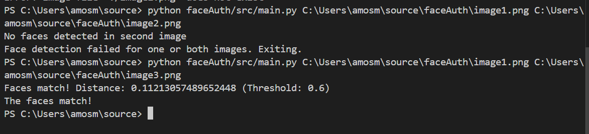

 **Face Authentication Library**

The Face Authentication Library provides functionality for detecting, encoding, and matching faces using Haar cascades and the `face_recognition` library. This library is designed to facilitate facial recognition tasks, making it easy to integrate face matching into your Python projects.


 **Features**
- Detect faces in images using Haar cascades.
- Extract 128-dimensional face encodings for detected faces.
- Compute Euclidean distances between face encodings for similarity comparison.
- Determine if two faces match based on a configurable similarity threshold.


 **Installation**

1. Clone the repository:
   ```bash
   git clone https://github.com/merber520/faceAuth.git
   cd faceAuth
   ```

2. Install the required dependencies:
   ```bash
   pip install -r requirements.txt
   ```


 **Usage**
Here’s how you can use the library in your project:

### **1. Import the Library**
```python
from faceAuth.main import detect_face_haar, get_face_encodings, compute_distances, match_face_encodings
```

### **2. Example Workflow**
```python
# Paths to your images
image1 = "path/to/image1.png"
image2 = "path/to/image2.png"

# Step 1: Detect faces in both images
face1, face2 = detect_face_haar(image1, image2)

# Step 2: Generate encodings for the detected faces
encoding1, encoding2 = get_face_encodings(image1, face1, image2, face2)

# Step 3: Compute the distance between the encodings
distance = compute_distances(encoding1, encoding2)

# Step 4: Match the faces based on the distance
is_match = match_face_encodings(distance, threshold=0.6)

if is_match:
    print("The faces match!")
else:
    print("The faces do not match.")
```


### **3. Configurable Paths**
To allow users to provide custom image paths, modify the paths directly in the script:
```python
image1 = input("Enter the path to the first image: ")
image2 = input("Enter the path to the second image: ")
```

---

## **Custom Threshold**
Adjust the threshold in the `match_face_encodings` function to suit your application's tolerance for false positives or negatives:
- **Lower Threshold**: Stricter match criteria.
- **Higher Threshold**: More lenient matching.

---

## **Dependencies**
- `opencv-python`
- `face-recognition`
- `numpy`

Install them with:
```bash
pip install -r requirements.txt
```

---

## **Contributing**
Contributions are welcome! Please fork the repository and submit a pull request for review.

---

## **License**
This project is licensed under the MIT License. See the [LICENSE](LICENSE) file for details.

---

## **Author**
- **Amos Merber**  
- Email: amosmerber@gmail.com  
